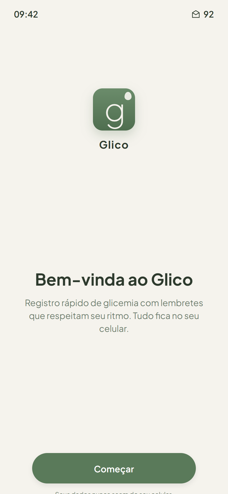
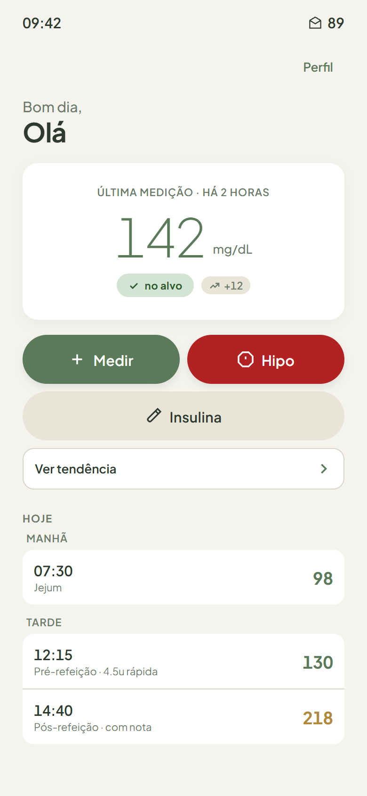
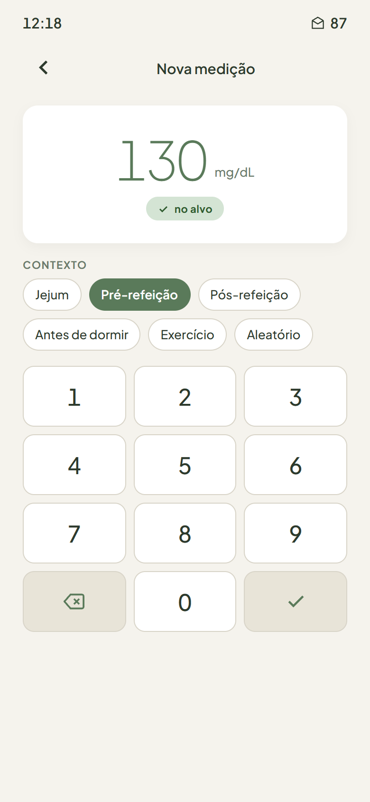
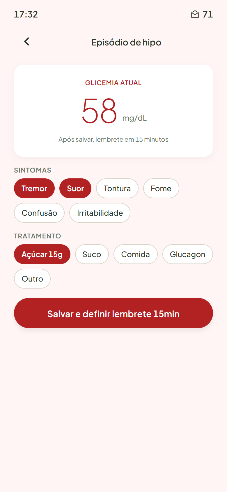
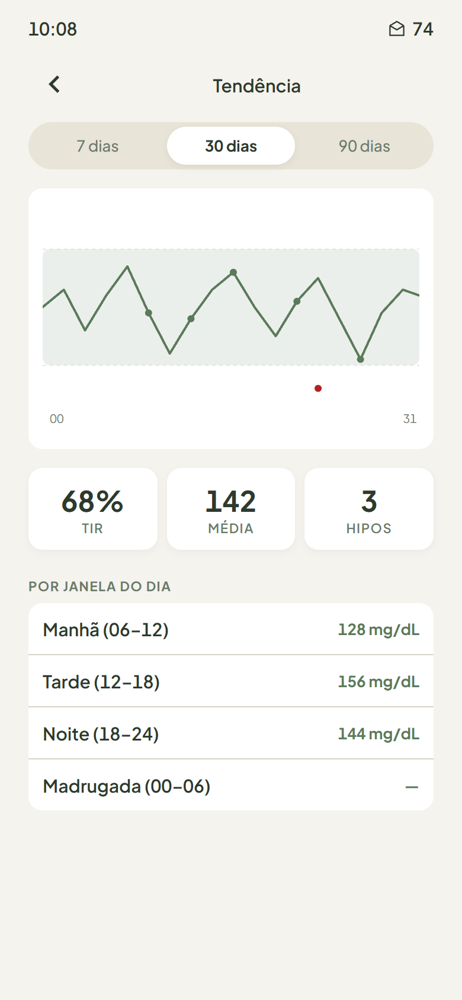
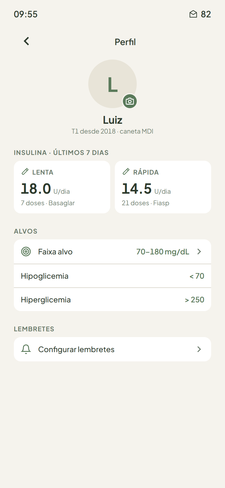

# Glico

Aplicativo Android single-user para registro de glicemia capilar, doses de insulina e episódios de hipoglicemia em diabetes tipo 1.

Offline-first. Dados ficam no aparelho. Sem login, sem servidor, sem analytics.

[Baixar APK v0.1.0](https://github.com/Luizhcrs/glico-app/releases/latest) · [Documentação](#documentação) · [Licença](LICENSE)

## Telas

| Bem-vinda | Home | Logar |
|---|---|---|
|  |  |  |

| Hipoglicemia | Tendência | Perfil |
|---|---|---|
|  |  |  |

---

## Stack

Expo SDK 54 · React Native · TypeScript · expo-router · expo-sqlite · victory-native · Plus Jakarta Sans · Lucide

## Setup

```bash
npm install --legacy-peer-deps
CI=1 EXPO_PACKAGER_HOSTNAME=<ip-do-pc> npx expo start --dev-client --port 8082
```

Pré-requisitos: Node 20, Android dev-client APK (build via EAS).

## Build APK

```bash
eas build --platform android --profile preview     # APK standalone
eas build --platform android --profile development # com Metro hot reload
```

## Verificações

```bash
npx tsc --noEmit
npx jest
```

## Documentação

| Arquivo | Conteúdo |
|---|---|
| [`CHANGELOG.md`](CHANGELOG.md) | Versões e mudanças |
| [`CONTRIBUTING.md`](CONTRIBUTING.md) | Workflow de mudança e padrões |
| [`SECURITY.md`](SECURITY.md) | Política de segurança e modelo de ameaça |

## Estrutura

```
app/         # telas (expo-router)
src/
  db/        # SQLite client, schema, migrations
  domain/    # types, validators, repositories, stats
  notifications/
  crypto/
  pdf/
  ui/        # theme, components, hooks
assets/      # ícones, splash, branding SVGs
tests/       # unit, integration, e2e
```

## Licença

Proprietário. Uso pessoal. Ver [LICENSE](LICENSE).

Glico não é um dispositivo médico. Não diagnostica, não calcula doses, não substitui orientação clínica.
